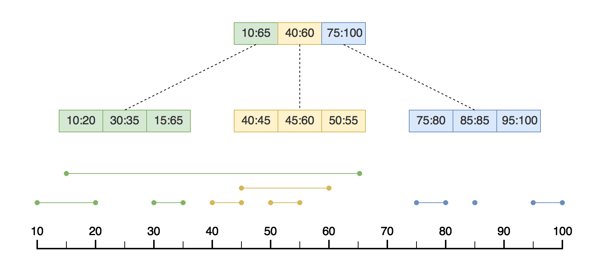

# Sort-tile-recursive One-dimensional R-tree Specification

## Header Format
```
+----------------------------------------------------------------+
|   "s1r" string in binary + 4 bytes for version (Major.minor)   |
+----------------------------------------------------------------+
| 01110011 00110001 01110010 MMMMMMMM MMMMMMMM mmmmmmmm mmmmmmmm |
+----------------------------------------------------------------+

+-------------------------------------------------------------------------------------------------------------------------------------------------+
| 16 byte UUID used to match index to indexed file                                                                                                |
+-------------------------------------------------------------------------------------------------------------------------------------------------+
| UUUUUUUU UUUUUUUU UUUUUUUU UUUUUUUU UUUUUUUU UUUUUUUU UUUUUUUU UUUUUUUU UUUUUUUU UUUUUUUU UUUUUUUU UUUUUUUU UUUUUUUU UUUUUUUU UUUUUUUU UUUUUUUU |
+-------------------------------------------------------------------------------------------------------------------------------------------------+
```
```
+----------+----------+
| RRRRRRSS | BBBBBBBB |
+----------+----------+
R: Reserved.
S: Point in region by which to sort entries. (00 for midpoint, 10 for left and 01 for right).
B: Block size (B + 1 Kibibytes). 
```

Each chromosome is described with the following.
```
+----------+vvvvvvvvvvv+-------------------------------------------------------------------------+
| SSSSSSSS | CHROM_STR | RRRRRRRR RRRRRRRR RRRRRRRR RRRRRRRR RRRRRRRR RRRRRRRR RRRRRRRR RRRRRRRR |
+----------+vvvvvvvvvvv+-------------------------------------------------------------------------+
S: Size of chromosome byte array encoded in one byte (1-255 range). A size of 0 terminates the chromosome list. 
CHROM_STR: Chromosome byte array of size S bytes.
R: Number of records.
B: Max base pair position.
F: Max file position.
```

Current block is then padded with zeros up to the next multiple of 65,536. Following the header is a tree for each chromosome. Trees are in the same order as listed in the header.

## Internal Nodes
Internal nodes contain at most (block size / 8) entries. Entries are made up of two big-endian 32-bit integers. The first of which represents the start value of the interval while the second represents the length of the interval.

## Leaf Nodes
Internal nodes contain at most (block size / 16) entries. Entries are made up of two big-endian 32-bit integers and one 64-bit integer. The first of the 32-bit integers represents the start value of the interval. The second represents the length of the interval. The 64-bit integer represents the offset of the record in the target file. In most cases, the unit for the record offset and length is a byte.

## Tree Structure
The index file begins with the header block followed by the root block. Then each level of the tree going downward is stored from left to right. All nodes must be full except for the last node at each level.

The number of nodes at each level and the positions of child nodes are calculated using using the record count and block size.

Take for example a tree that contains 1,000,000 records with a node size of 4096 bytes. The leaf nodes fit a maximum of 256 entries, while the internal nodes fit 512. 1,000,000 is divided by 256 to get 3,907 leaf nodes. 3,907 is divided by 512 to get 8 internal nodes at the next level up. Since 8 is less than 512, the following level contains the root node.    

## Generating the Tree
Trees are created by first sorting all entries by the midpoint of their intervals. The tree is then built from the bottom up with the intervals of each entry in the internal nodes representing the smallest range that contains the child node's intervals. 

##

